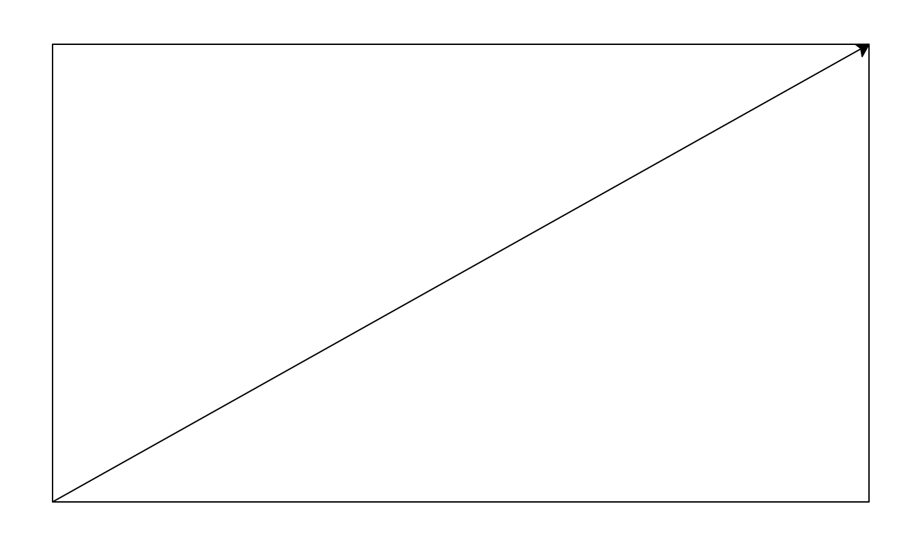

# mates

ratri.py Razones Trigonometricas


```python
import math

# Ejemplo de Razones trigonométricas
cateto_contiguo=59.8
cateto_opuesto=33.6
print("Cateto contiguo: ", cateto_contiguo)
print("Cateto opuesto: ", cateto_opuesto)
hipotenusa=math.sqrt(cateto_contiguo**2+cateto_opuesto**2)
print("Hipotenusa: ", hipotenusa)
```

```
Cateto contiguo:  59.8
Cateto opuesto:  33.6
Hipotenusa:  68.59300255857006
```


```python
import turtle
turtle.penup()
turtle.goto(-cateto_contiguo/2,0)
turtle.pendown()

turtle.forward(cateto_contiguo)
turtle.left(90)
turtle.forward(cateto_opuesto)
turtle.left(90)
turtle.forward(cateto_contiguo)
turtle.left(90)
turtle.forward(cateto_opuesto)
turtle.left(90)

angulo=math.atan(cateto_opuesto/cateto_contiguo)
# radianes a grados
angulo=angulo*180/math.pi
turtle.left(angulo)
turtle.forward(hipotenusa)

turtle.done()
# pause until press a key
input("Press any key to finish")


