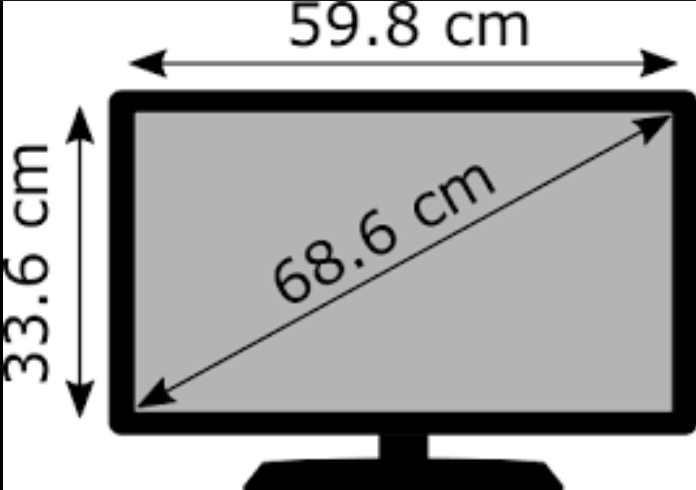

# mates

ratri.py Razones Trigonometricas



```python
import math

# Ejemplo de Razones trigonométricas
cateto_contiguo=59.8
cateto_opuesto=33.6
print("Cateto contiguo: ", cateto_contiguo)
print("Cateto opuesto: ", cateto_opuesto)
hipotenusa=math.sqrt(cateto_contiguo**2+cateto_opuesto**2)
print("Hipotenusa: ", hipotenusa)
```

````
Cateto contiguo:  59.8
Cateto opuesto:  33.6
Hipotenusa:  68.59300255857006
```
